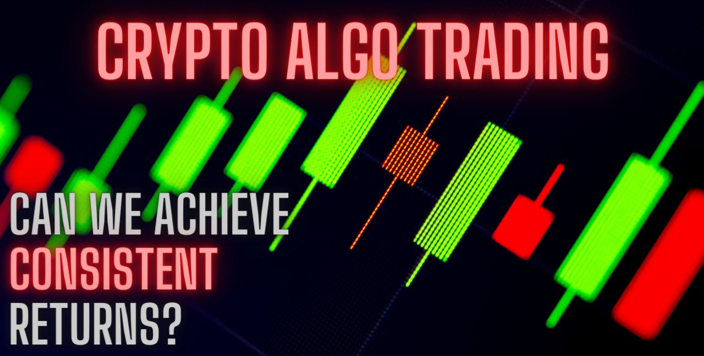
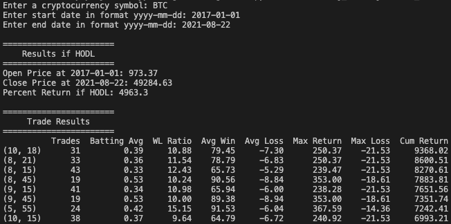

  <!--  -->

  

  

  

  

  <a href="https://github.com/crypto-algo-trading/crypto-algo-trading/blob/master/LICENSE" target="_blank">
    
  

A collection of scripts that combine historical price data from Coinbase Pro with community/social data from LunarCRUSH to create a unique database that can be used to research different trading strategies (or algorithms) and code up screeners. Could we take a traditional EMA-crossover strategy and supplement with the moving average of the past 5 days of raw influencer mentions? This project aims to find out.
  
# Table of Contents
- [Table of Contents](#table-of-contents)
- [Installation](#installation)
- [Usage](#usage)
- [ETL](#etl)
  - [Extract](#extract)
    - [Coinbase Pro](#coinbase-pro)
    - [LunarCRUSH](#lunarcrush)
  - [Transform](#transform)
  - [Load](#load)
- [Trading Strategies](#trading-strategies)
  - [EMA Crossover](#ema-crossover)
    - [How to Use](#how-to-use)
    - [Example Results](#example-results)
- [Trading Screeners](#trading-screeners)
  - [Mean Reversion](#mean-reversion)
- [Future Updates](#future-updates)
- [Resources](#resources)

# Installation
* Clone this repo to your computer.
* It is **highly** recommended to create a python virtual environment. A good tutorial can be found [here](https://packaging.python.org/guides/installing-using-pip-and-virtual-environments/#creating-a-virtual-environment).  
* Install the requirements using `pip3 install -r requirements.txt`.
    * Make sure to use Python 3 and activate your virtual environment if you decided to create one.
* If you want to experiment with social data available in the lunarCRUSH API you will need to obtain an API key [here](https://lunarcrush.com/developers/docs). This is **not required** in the current version of the project and the ETL code related to lunarCRUSH has been commented out.
* Set working directory to `etl` and run `extract and load_data.py` to load historical prices from Coinbase.
  

# Usage
There are two ways you can use this repo:
1. Run `extract_and_load_data.py` to obtain a dataset of historical price data from Coinbase.
   * Note: Each row contains the daily [OHLC](https://www.investopedia.com/terms/o/ohlcchart.asp) (Open, High, Low, Close) for each cryptocurrency for every day it was available to trade on Coinbase. Daily price data is locked as of 00:00 GMT. If you run the ETL code before 00:00 GMT you will get a row for that day but the values may change until 00:00 GMT.
2. Using historical price data, run [trading strategies](#trading-strategies) found in `/trading_strategies/*strategy`
  

# ETL
The backbone of this project is the ETL (Extract, Transform, Load) process that currently utilizes two (2) public APIs to obtain historical data for various cryptocurrencies. I decided to use Coinbase Pro data because the API is easy to use (with Python wrapper) and it's my preferred service for trading crypto.

Since Bitcoin is the "grandfather" of modern cryptocurrency, I decided to use it's historic trading availability as the start date for this data pull. After doing some research, I found out that it was listed on Coinbase Pro (at the time GDRX) in 2015 so I decided on `2015-01-01` as the start date. End date would be the current day as determined by the value of `datetime.now()`.

## Extract

### Coinbase Pro
* Get all cryptocurrencies available using `get_currencies` endpoint
* For each cryptocurrency, utilize `get_product_historic_rates` endpoint
  * Note: there are a few currencies that do not have historic rates available. These were skipped when pulling the data from the API
* Finally, save the data to a SQLite database

### LunarCRUSH
* Coinbase cryptocurrency list was fed into the `assets` endpoint
* For each cryptocurrency, extract data from the 'timeseries' dictionary:

## Transform
Data quality from the two APIs was very good and there wasn't much data cleaning required to get suitable data for joining. The biggest challenge was working with timeseries data. I had to use the following functions quite extensively:
* `datetime.strftime()`: takes a date value and returns a string, with a user-defined format. I used `'%Y-%m-%d'` since it is easy to work with.
* `datetime.strptime()`: takes a string value and returns a datetime object. The user must define a string format, which in my case was `'%Y-%m-%d'`.

## Load
I decided on a SQL database for two reasons:
1. I wanted to practice SQL
2. I intend for this to be a project I continuously add to and it just seemed unruly to have an ever expanding set of .csv files
3. SQL is powerful and it would be very easy to manipulate the data to get what I want

I ended up choosing SQLite because it is easy to set-up and maintain using Python (my preferred coding language).
  

# Trading Strategies
## EMA Crossover
The EMA (exponential moving average) Crossover trading strategy is one of the simplest strategies out there and good for beginners. It is what is called a **trend following** strategy. The idea is to buy at the start of a new uptrend or sell your position at the start of a new downtrend. This strategy does not do well when the market is considered to be **trendless**. 

First, an exponential moving average (EMA) is a type of moving average (MA) that places a greater weight and significance on the most recent data points. I like to work with these because they tend to produce more signals than a simple MA because it responds to price changes faster. Read more [here]("https://www.investopedia.com/terms/e/ema.asp").

The strategy consists of one **fast** and one **slow** EMA. The lower the number of values used to calculate the EMA the "faster" it is. In other words, it's value is closer to price. It can be thought to capture the short-term trend of an asset. The slower EMA uses more datapoints to determine the intermediate or long-term trend. 

Thus, the crossover strategy guesses that when the short-term price trend of an asset crosses above the long-term price trend, a new long-term trend is established, based upon the direction of the cross (up = bullish, down = bearish).

Below is an example of a BTC trade using the 8 and 21 Day EMAs. Sometimes you can capture moves of more than 150%!
  

### How to Use
* Run `/trading_strategies/ema_crossover_strategy` using the dataset from `/etl/extract_and_load_data.py`
  * The dataset needs to be in DataFrame format
### Example Results

  

  

Surprisingly, we were able to almost **double** our returns on BTC compared to a buy-and-hold (or [HODL-ing]("https://www.investopedia.com/terms/h/hodl.asp")) strategy through the bear market after the 2017 bull-run.

Even more shocking are the ETH results. A crossover strategy was able to return 303,520% compared to a paltry 39,623% when HODL-ing. That's remarkable! Also fishy...after doing some digging it was apparent that we ended up getting lucky and catching a move from $8.38 to $263.12. A return of 3,039%. But was it luck or the power of following a trend until it is likely to reverse? I intend to do a study where I take random 6-month timeframes and compare the crossover strategy to buy-and-hold. On average, I expect the trading strategy to be profitable but have lower returns to holding.

# Trading Screeners

## Mean Reversion
The mean reversion screener is a way to add some confidence to a potential trade. This code calculates how many standard deviations an asset's closing price is to it's historical 50 Day Moving Average (average of the last 50 days of price). The thought being, if an asset's price is *extended* above or below it's 50 Day Moving Average, there is a good chance that it will revert to the mean.

This idea works great in crypto because coins tend to run up in huge moves after long periods of consolidation. This happens in cycles. Given enough data points, we can reliably buy or sell once the asset reaches an extreme standard deviation (e.g. 3+).

Below is an example of a ADA trade looking at two periods where price is very far from it's 50 Day MA. Could we see another large correction? If we bought on the cross of the 8 Day EMA over the 21 Day EMA it might be a good time to sell some of our position and **lock in profit**. As they say, history doesn't repeat but it does rhyme...
  

  

# Future Updates
This project is still very much a work in progress and I will be adding to it over time as I come across new trading strategies/ideas and build out my edge in the markets. I still haven't even touched the social data aspect I was able to grab from the lunarCRUSH API. Stay tuned for that.

* Add functionality to add missing timeseries data to the existing database once set up, rather than recreate the database everytime
* Flesh out notebooks to provide more background and analysis on the various strategies and screeners available
* Create a notebook to showcase SQL analysis of the raw data

# Resources
* [Coinbase Pro API](https://docs.pro.coinbase.com)
* [Coinbase Pro API Python Wrapper](https://github.com/danpaquin/coinbasepro-python)
* [LunarCRUSH API](https://lunarcrush.com/developers/docs)
* Richard Moglen's excellent [Python for Finance] playlist(https://www.youtube.com/watch?v=myFD0np9eys&list=PLPfme2mwsQ1FQhH1icKEfiYdLSUHE-Wo5) on Youtube. The skeleton of the ema crossover script came from him and I added to it.